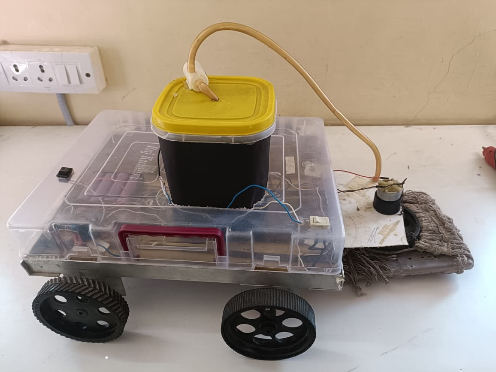

# Bluetooth Controlled Floor Cleaning Robot

## Project Overview

The Bluetooth Controlled Floor Cleaning Robot is a low-cost cleaning automation system developed using Arduino UNO, HC-05 Bluetooth Module, and L298N Motor Driver.

The robot can be controlled wirelessly through a smartphone using Bluetooth communication. It performs floor cleaning with the help of a water spraying mechanism and cleaning mop assembly, reducing manual cleaning effort.

---

## Project Image

---

## Components Used

* Arduino UNO
* HC-05 Bluetooth Module
* L298N Motor Driver
* DC Gear Motors
* Robot Chassis
* Water Tank
* Cleaning Mop
* Battery Pack
* Connecting Wires

---

## Features

* Bluetooth-based wireless control
* Forward, backward, left, and right movement
* Adjustable speed control
* Water spraying mechanism
* Floor mopping system
* Battery-powered operation

---

## Working Principle

1. The HC-05 module receives commands from a smartphone application.
2. Arduino UNO processes the received commands.
3. The L298N motor driver controls the movement of DC motors.
4. The robot moves according to the user's command.
5. Water is sprayed on the floor through the attached tank.
6. The cleaning mop wipes the floor while moving.

---

## Connection Diagram

The complete connection diagram is available in the Documentation folder.

---

## Source Code

Arduino source code is available in the Code folder.

---

## Applications

* Household floor cleaning
* Educational robotics projects
* Automation demonstrations
* Smart home systems

---

## Future Improvements

* Obstacle detection sensors
* Autonomous navigation
* Mobile application interface
* Rechargeable battery monitoring
* IoT-based remote control

---

## Author

**Swastik Shewatkar**

Bachelor of Engineering (Electronics and Telecommunication Engineering)
